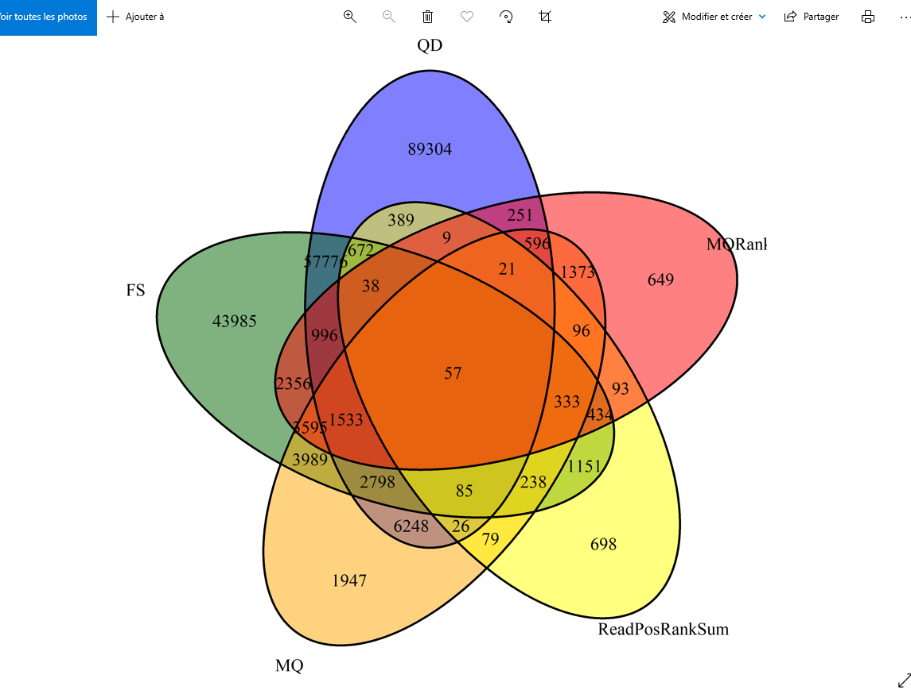
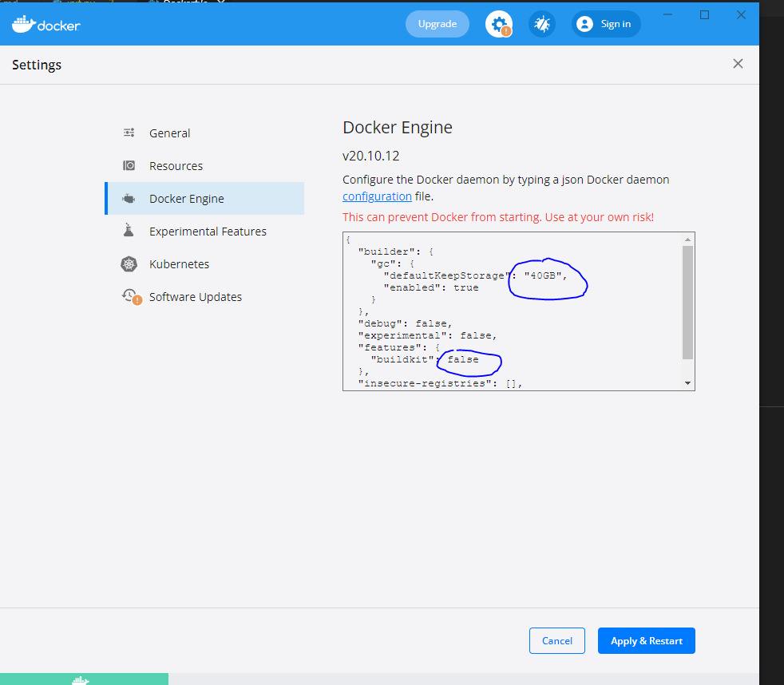

# AIM of the project

Estimate the evolutionary histories of natural and domesticated yeast

## KIT


## Display



## Requirement:

Having docker and git installed </br>

- https://www.ebi.ac.uk/ena/browser/view/PRJEB24932?show=reads
  -get docker her : https://docs.docker.com/engine/install/ </br> it would be better to have the latest versions 4.6 and above </br>
  -get docker-compose her : https://docs.docker.com/compose/install/ </br>
  -get git her : https://git-scm.com/downloads </br>

## Installation

## MAC/Windows


telecharger les fatsq et le genome de reference depuis de site de l'ENA (voir liens au dessus)

sur le shell

```
git clone Sykzen/Project-bio-info
cd Project-bio-info
docker-compose up --build
```

## Linux

```
git clone Sykzen/Project-bio-info
cd Project-bio-info
/usr/bin/python3 init_linux.py #/usr/bin/python si python3=python
docker buildx create --use --name larger_log --driver-opt env.BUILDKIT_STEP_LOG_MAX_SIZE=50000000
docker buildx build .
```

Docker buildx est installé de base sur les verions de docker 4 et supérieur

## Export Data

```
great_mccarthy le nom du container
```

docker cp great_mccarthy:/home/Project/export ./export

## Compiler l'ipnyb

avoir les flagstats sur jupyter notebook

## Contributors

- [Sykzen](https://github.com/Sykzen)
- [Sarmedd](https://github.com/Sarmedd)
- [BOUNEGTAMohamedRami](https://github.com/BOUNEGTAMohamedRami)
